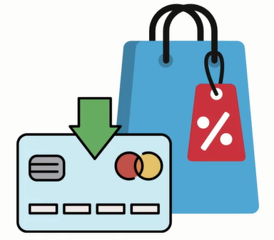
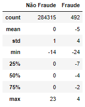
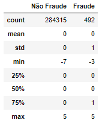
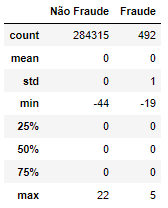
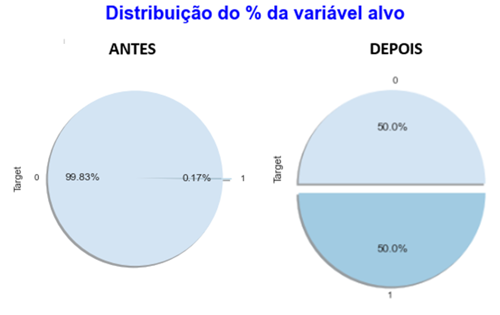
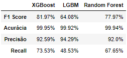
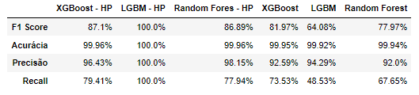
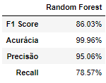
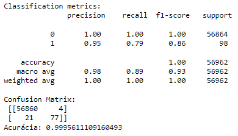

# Detectando Fraudes em Transferências Bancárias
Este repositório contém script de uma máquina preditiva de detecção de transferências fraudulentas

 

# _Objetivo do projeto_

O objetivo deste projeto é desenvolver um modelo preditivo capaz de detectar transações fraudulentas em uma Instituição Financeira, utilizando técnicas de ciência de dados.

 

# _1. Problema de Negócio_

Neste conjunto de dados fictício possui transações de transferências entre contas de uma mesma Instituição Financeira. São mais de 200 mil registros de transferências, sendo 490 Fraudulentas, ou seja, não foram realizadas pelo dono da conta corrente.

Temos 28 variáveis explicativas e a variável Classe é o Target e assume o valor 1 em caso de fraude e 0 em caso contrário.

Golpe em dados bancários pela internet cresceu 43% no Brasil.

Fonte: https://economia.ig.com.br/2020-07-28/golpe-em-dados-bancarios-pela-internet-cresceu-43-no-brasil-saiba-se-proteger.html

O problema de negócio consiste na ocorrência de transferências fraudulentas entre contas de uma mesma Instituição Financeira, o que pode causar prejuízos financeiros tanto para a instituição quanto para seus clientes.

Esse conjunto de dados fictício possui transações de transferências entre contas de uma mesma Instituição Financeira.

 

# _2. Justificativa_

- **Por quê:** A implementação desse projeto é importante devido ao crescente aumento de golpes e fraudes em transações bancárias pela internet, como evidenciado no artigo citado que aponta um aumento de 43% nesse tipo de golpe no Brasil. A detecção e prevenção de transferências fraudulentas são essenciais para garantir a segurança das transações e proteger os clientes da Instituição Financeira.
- **Como:** Através da construção de um modelo preditivo de detecção de fraudes utilizando algoritmos de classificação, será possível identificar padrões e características que distinguem as transações fraudulentas das legítimas. Esse modelo poderá ser integrado ao sistema de detecção de fraudes da instituição, auxiliando na tomada de decisões e na redução dos prejuízos causados por atividades fraudulentas.
- **O quê:** A solução proposta consiste em desenvolver um modelo preditivo capaz de classificar as transações como fraudulentas ou não fraudulentas. O modelo será treinado com base nos dados históricos de transações e poderá ser utilizado em tempo real para avaliar a autenticidade de novas transações.

 

# _3. Premissas_

As variáveis originais do conjuto de dados são: 

Variável | Definição
------------ | -------------
Timestamp | Data e hora da transferência bancária.|
País | País onde a transferência foi feita.
Cidade | Cidade onde a transferência foi feita.
Bairro | Bairro onde a transferência foi feita.
CEP | Código postal do local da transferência.
IP | Endereço IP do dispositivo que iniciou a transferência.
Dia | Dia do mês em que a transferência foi feita.
Hora | Hora do dia em que a transferência foi feita.
Minuto | Minuto da hora em que a transferência foi feita.
SO | Sistema operacional do dispositivo que iniciou a transferência (por exemplo, Windows, Linux, Mac OS).
Valor | Valor da transferência em reais.
Antecedentes | Número de antecedentes criminais do proprietário da conta bancária.
Reclamações | Número de reclamações registradas contra a conta bancária.
Qtd_trans | Número de transferências realizadas pela conta bancária.
CRT | Crédito bancário.
Limite_global | Limite de crédito global.
Tipo_crt | Tipo de crédito (por exemplo, pessoal, consignado).
Estabelecimento | Nome do estabelecimento onde a transferência foi feita.
Contas | Número de contas vinculadas à conta bancária.
Empréstimos | Número de empréstimos concedidos à conta bancária.
Navegador | Navegador da web usado para iniciar a transferência.
Android | Versão do sistema operacional Android (se o dispositivo que iniciou a transferência for um dispositivo Android).
iOS | Versão do sistema operacional iOS (se o dispositivo que iniciou a transferência for um dispositivo iOS).
Compras | Número de compras realizadas pela conta bancária.
Hist_navegacao | Histórico de navegação da web do dispositivo que iniciou a transferência.
Relacionamento | Tempo de relacionamento com a instituição financeira.
Ind_seguranca | Nível de segurança da transação bancária.
Tempo_transacao | Tempo de duração da transação bancária.
Lim_crt | Limite de crédito da conta bancária.
Hist_saldo | Histórico de saldo da conta bancária.
Target | Variável alvo que indica se a transação bancária é fraudulenta (1) ou não (0).

Nesta base de dados já foi feito um tratamento anterior de codificação das variáveis, então essa base está pré-processada e podemos focar em Machine Learning.

 

# _4. Planejamento da Solução_

0. **ENTENDIMENTO DO NEGÓCIO**

Definição do problema: É importante definir claramente qual é o problema a ser resolvido ou a pergunta a ser respondida. É preciso entender o objetivo do projeto e a relevância do problema.

    - Descrição do negócio
    - Planejamento da solução

1. **IMPORTANDO AS BIBLIOTECAS**

Importação de bibliotecas: Nesta etapa, as bibliotecas necessárias para o desenvolvimento do modelo de machine learning são importadas. Isso inclui bibliotecas para manipulação de dados, visualização, modelagem e avaliação.

2. **COLETA DOS DADOS**

Coleta de dados: Nesta etapa, os dados são coletados a partir de diversas fontes, como bases de dados, APIs, arquivos de texto, imagens, etc.

3. **FUNÇÕES AUXILIARES**

Funções auxiliares: Nesta etapa, são criadas funções que serão utilizadas ao longo do projeto para realizar tarefas específicas, como limpeza de dados, visualização de gráficos, pré-processamento, entre outros.

4. **ANÁLISE EXPLORATÓRIA DOS DADOS**

Análise exploratória de dados: Nesta etapa, os dados são analisados para identificar possíveis padrões, tendências, correlações e informações relevantes que possam auxiliar na construção do modelo de machine learning. É importante entender os dados coletados, avaliar a qualidade dos dados e identificar quaisquer problemas ou limitações.

    - **Passo 1:** Análise Descritiva dos Dados
        - Esta etapa consiste na descrição estatística dos dados coletados, como média, mediana, desvio padrão, entre outros.
    - **Passo 2:** Exploração de Dados
        - Nesta etapa, os dados são visualizados e analisados graficamente para identificar padrões e relações entre as variáveis.    

5. **PRÉ-PROCESSAMENTO**

Preparação de dados ou Pré-processamento de dados: Nesta etapa, os dados são limpos, transformados e preparados para serem utilizados no modelo de machine learning. Isto inclui tarefas como normalização, codificação, preenchimento de valores ausentes, remoção de outliers, etc.

Divisão dos dados em conjuntos de treinamento e teste: Nesta etapa, os dados são divididos em conjuntos de treinamento e teste para avaliar o desempenho do modelo.

6. **TREINAMENTO ALGORITMOS DE MACHINE LEARNING**

Modelagem ou Seleção do modelo: Nesta etapa, um modelo de machine learning é escolhido com base na tarefa a ser realizada e nos dados disponíveis.

Treinamento do modelo: Nesta etapa, o modelo é treinado utilizando o conjunto de treinamento.

7. **AJUSTE FINO DE HIPERPARÂMETROS**

Avaliação de modelo: Nesta etapa, o modelo é avaliado utilizando o conjunto de teste para verificar a sua capacidade de generalização para dados não vistos durante o treinamento.

8. **AVALIAÇÃO DO ALGORITMO**

Avaliação do modelo: Nesta etapa, o desempenho do modelo é avaliado utilizando métricas adequadas para o tipo de problema e modelo utilizado, como acurácia, precisão, recall, F1-score, entre outras.

9. **IMPLEMENTAR O MODELO PARA A PRODUÇÃO**

Implantação: Nesta etapa, o modelo é implantado em um ambiente de produção para utilização em situações reais para resolver o problema.

10. **INSIGHTS**

Nesta etapa, são identificadas as principais descobertas e conclusões do projeto.

11. **PRÓXIMOS PASSOS**

Nesta etapa, são definidos os próximos passos a serem tomados com base nos resultados obtidos e nos insights identificados. Isso pode incluir melhorias no modelo existente, coleta de mais dados, exploração de diferentes modelos, entre outros.

 

# _5. Insights_

*Resumo dos insights durante análise exploratória de dados (EDA):*

**1º Tabela: Analisando o valor da transferência em reais**

 

**Nota:**
- A média dos valores para transações que não são fraude é zero, enquanto que para transações fraudulentas a média é de -5.
  - Isso indica que os valores das transações fraudulentas tendem a ser menores do que os valores das transações que não são fraude. A diferença média pode sugerir que os fraudadores estão tentando realizar transações menores para evitar detecção e tornar as transações mais difíceis de serem rastreadas.
- O desvio padrão maior para transações fraudulentas.
  - Pode indicar maior variação nos valores das transações fraudulentas, ou seja, alguns fraudadores podem tentar realizar transações maiores enquanto outros optam por transações menores.
- Essas informações podem ser úteis na construção de modelos preditivos para detectar fraudes em transações financeiras.
- Além disso, a maior variabilidade nos valores das transações fraudulentas pode indicar que os fraudadores têm diferentes estratégias para obter lucro, o que resulta em valores variados.

**2º Tabela: Número de empréstimos concedidos à conta bancária**

 

**Nota:**

- O desvio padrão (std) é 0 para transações não fraudulentas e 1 para fraudulentas.
  - Isso sugere que a maioria das transações não envolve empréstimos concedidos à conta bancária, mas para as transações fraudulentas, há alguma variabilidade nas observações.
- O valor mínimo (min) para transações que não são fraude é -7, enquanto para transações fraudulentas é -3.
  - Indica que houve casos em que empréstimos foram concedidos à conta bancária em transações tanto de fraude quanto não fraude.
- O terceiro quartil (75%) é 1 para transações fraudulentas.
  - O que indica que pelo menos 75% das observações fraudulentas envolvem um empréstimo concedido à conta bancária.

**3º Tabela: Número de compras realizadas pela conta bancária**

 

**Nota:**

- O número médio de compras realizadas pela conta bancária é zero tanto para as transações que são fraudes quanto para as que não são fraudes.
  - Isso significa que, em média, o número de compras realizadas pela conta bancária é baixo e não é um fator muito relevante para determinar se uma transação é fraudulenta ou não.
- Além disso, a maioria dos valores é igual a zero (os quartis 25%, 50% e 75% são iguais a zero).
  - Em outras palavras, a maior parte das transações não envolve a realização de compras pela conta bancária.
- O valor máximo para compras não fraudulentas é 22, enquanto para transações fraudulentas é 5.
  - Indicando que houve casos em que a conta bancária realizou um número relativamente grande de compras, mas muito menos frequentemente do que em casos suspeitos de fraude. O fato de que o valor máximo para transações não fraudulentas é maior do que para transações fraudulentas pode indicar que a conta bancária em questão é usada com mais frequência para transações legítimas, mas ainda pode haver casos em que a atividade é suspeita. É importante considerar outros fatores além do número de compras realizadas ao analisar a suspeita de fraude em transações bancárias.

 

# _6. Modelos de Machine Learning_

_**Balanceamento dos dados:**_

 

_**Foi usado três algoritmos para construir o modelo de classificação:**_

1. XGBoost Regressor
2. Light Gradient Boost Machine ( LGBM )
3. Random Forest

_**Comparar o desempenho dos modelos de machine Learning:**_

 

**Nota:**

Essa tabela mostra o desempenho de três modelos de classificação - XGBoost, LGBM e Random Forest - usando quatro medidas de avaliação: F1 Score, Acurácia, Precisão e Recall.

O F1 Score é uma medida que combina a Precisão e o Recall, indicando a capacidade do modelo em balancear a quantidade de verdadeiros positivos e falsos positivos, bem como a quantidade de verdadeiros negativos e falsos negativos. Um valor alto indica um bom desempenho do modelo.

A Acurácia é a medida mais simples, indicando a proporção de previsões corretas em relação ao total de previsões. É uma medida útil, mas pode não ser suficiente para avaliar a qualidade de um modelo, especialmente quando as classes estão desbalanceadas.

A Precisão mede a proporção de verdadeiros positivos em relação ao total de positivos previstos, ou seja, a capacidade do modelo de não classificar um exemplo negativo como positivo. Um valor alto indica que o modelo faz poucos falsos positivos.

O Recall mede a proporção de verdadeiros positivos em relação ao total de positivos reais, ou seja, a capacidade do modelo de detectar todos os exemplos positivos. Um valor alto indica que o modelo faz poucos falsos negativos.

- A partir desses resultados, podemos observar que o modelo XGBoost apresentou o melhor desempenho em todas as medidas de avaliação, com destaque para o F1 Score, que foi de 81.97%. O modelo LGBM apresentou um desempenho um pouco inferior, com destaque para a Precisão, que foi de 94.29%. Já o modelo Random Forest apresentou o pior desempenho, com destaque para o Recall, que foi de 66.18%. No entanto, é importante lembrar que a escolha do melhor modelo depende do contexto e das necessidades do problema em questão.

As vezes o algoritmo simples seja a melhor opção se a diferença não é muito distânte (menos é mais), porque um algoritmo complexo, onde vamos ter que fazer muita tunagem de hiperparametros, muito pré-processamento, isso pode na hora de implementar o modelo em produção, pode causar problemas.

_**Comparar o desempenho dos modelos de machine Learning - hiperparâmetros:**_

 

**Nota:**

Legenda HP: Hiperparâmetros (significa que o modelo passou por otimização de hiperparâmetros)

Se a métrica mais importante é o F1 Score, então o LGBM com ajuste de hiperparâmetros seria a escolha, pois obteve um resultado de 100%. Porém, se a acurácia é a métrica mais importante, todos os modelos apresentaram desempenho muito semelhante. Já se a precisão e o recall são as métricas mais importantes, então seria necessário avaliar qual modelo atende melhor a essas métricas. No geral, considerando as métricas apresentadas, o XGBoost com ajuste de hiperparâmetros e o LGBM com ajuste de hiperparâmetros são os modelos mais promissores.

- O XGBoost e o Random Forest, que passaram por ajuste de hiperparâmetros, tiveram um desempenho muito próximo em termos de F1-Score, com o LGBM obtendo o melhor resultado. No entanto, os modelos ajustados tiveram um tempo maior de treinamento, em comparação com os modelos não ajustados.
- Em termos de acurácia, todos os modelos apresentaram um excelente desempenho, com valores acima de 99,9%.
- A precisão, que representa a proporção de verdadeiros positivos em relação a todos os positivos previstos, foi excelente em todos os modelos, com o LGBM obtendo o melhor resultado.
- Já o recall, que representa a proporção de verdadeiros positivos em relação a todos os verdadeiros positivos, foi menor em comparação com as outras métricas, sendo o Random Forest o modelo com melhor resultado.

No entanto, é importante avaliar outros fatores, como a escalabilidade do modelo, a facilidade de implantação e manutenção, e a interpretabilidade das previsões.

- Se a equipe tem recursos suficientes para implementar e manter um modelo mais complexo, como XGBoost ou LGBM com ajuste de hiperparâmetros, esses modelos podem apresentar uma melhor precisão e desempenho em relação ao Random Forest - HP.
- Por outro lado, se a equipe não tem recursos para lidar com modelos mais complexos, o Random Forest - HP pode ser uma boa escolha, pois tem uma boa precisão e é relativamente simples de ser implementado e mantido.

Nesse caso, o Random Forest - HP também pode ser uma boa escolha, pois é um modelo relativamente fácil de interpretar.

Explicação:

Os modelos XGBoost e LightGBM são considerados mais complexos do que modelos de aprendizado de máquina mais simples, como Regressão Logística ou Árvores de Decisão, porque possuem mais parâmetros a serem ajustados e usam técnicas mais avançadas para construir árvores de decisão, como a otimização de gradiente e a amostragem ponderada.

Esses modelos também podem apresentar maior capacidade de generalização e melhor desempenho em conjuntos de dados maiores e mais complexos. No entanto, sua complexidade pode tornar a implementação e manutenção mais desafiadoras, e eles podem levar mais tempo para treinar em comparação com modelos mais simples.

_**Modelo final:**_

 

 

# _7. Performance do Modelo de Machine Learning_

 

**Nota:**

- Podemos dizer que o modelo Random Forest alcançou uma acurácia de 99.96%, o que significa que ele foi capaz de classificar corretamente a maioria das transações (tanto as genuínas quanto as fraudulentas). O modelo apresentou um desempenho muito bom na detecção de transações genuínas, acertando todas as 56.864 transações genuínas do conjunto de testes.
- Ao mesmo tempo, o modelo também detectou muitas transações fraudulentas, com uma precisão de 95.06%, o que significa que ele acertou a maioria das vezes quando indicou que uma transação era fraudulenta. O modelo também conseguiu detectar um bom número de transações fraudulentas, com um recall de 78.57%, o que significa que ele identificou a maioria das transações fraudulentas presentes no conjunto de testes.

Com base nesses resultados, podemos dizer que o modelo Random Forest é capaz de identificar a maioria das transações fraudulentas com uma alta precisão e recall, o que é muito importante para proteger o negócio contra perdas financeiras decorrentes de atividades fraudulentas.

 

# _8. Conclusão_

Em conclusão, o desenvolvimento e implementação de um modelo preditivo para detecção de transferências fraudulentas em uma Instituição Financeira é uma medida crucial para combater os golpes e proteger os clientes. Através da aplicação de técnicas de ciência de dados e algoritmos de classificação, foi possível construir um modelo capaz de identificar padrões e características associadas às transações fraudulentas. A implementação desse modelo permitirá uma detecção mais eficiente de atividades suspeitas, contribuindo para a redução de prejuízos financeiros e fortalecendo a segurança das transações bancárias. Além disso, o relatório detalhando as análises e descobertas fornecerá insights valiosos sobre os principais fatores associados às transações fraudulentas, permitindo que a Instituição Financeira tome medidas preventivas e melhore continuamente suas estratégias de segurança. Em um cenário onde os golpes bancários pela internet têm apresentado um crescimento significativo, essa solução desempenhará um papel fundamental na proteção dos clientes e na preservação da confiança na Instituição Financeira.

 

# _9. Próximos passos_

- Implementar o método de Threshold que é uma técnica utilizada para ajustar a probabilidade de predições em modelos de classificação binária.
    - Por exemplo: se o threshold for 0.5, todas as amostras com probabilidade maior ou igual a 0.5 serão classificadas como pertencentes à classe positiva e as demais como pertencentes à classe negativa. No entanto, o valor do threshold pode ser ajustado para alterar o trade-off entre precisão e recall do modelo.
